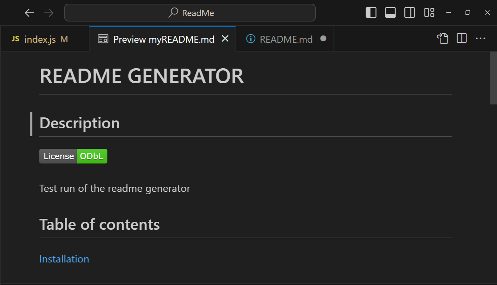

# README GENERATOR  
   ## Description 
   The objective of this project is to create a command-line application that dynamically generates a professional README.md file from a user's input using the Inquirer package. 

   This project has taught me how to use and install node modules such as inquirer in prompting questions from the user in the command line to generate .md files. This has allowed to understand the 
   concept in not just create .md files but other file types as well, for example html files which can be created using the same concept. 

   ## Installation 
   NA  
   ## Usage 
  To see a walkthrough of the readme generator please visit: 
   https://app.screencastify.com/v3/watch/u206zdBGW6e1BES2KiIu 

  

  Here is what the potential README will look like
  
   ## Licence 
  MIT licence 
   ## Contributions 
   NA 
  